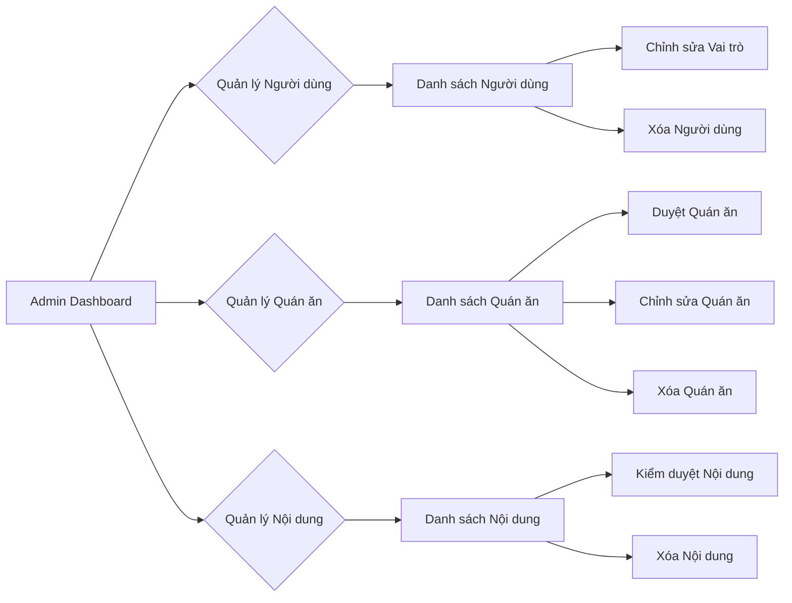
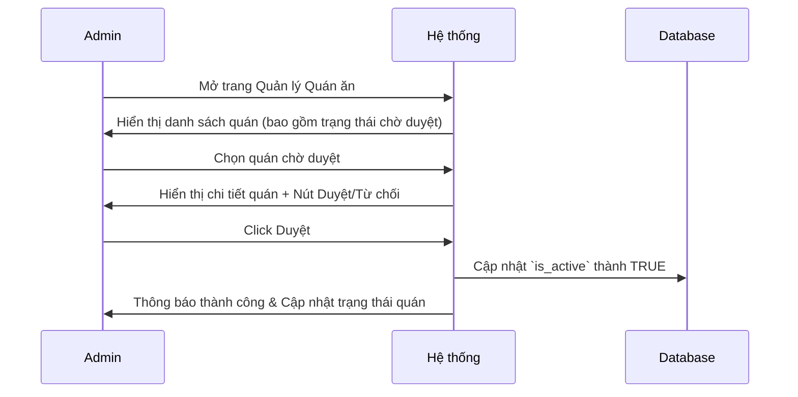

# Thiết kế Trang Admin (Admin Page Design)

## Mục tiêu
Thiết kế một trang quản trị toàn diện cho phép người dùng có vai trò `admin` quản lý các thực thể chính của hệ thống như người dùng, quán ăn, nội dung (video/bài viết), menu và chiến dịch quảng cáo.

## 1. Các Phần Chính của Trang Admin
Trang Admin sẽ được chia thành các phần chính, có thể truy cập qua một thanh điều hướng (sidebar) hoặc tab:

*   **1.1. Quản lý Người dùng (User Management)**
*   **1.2. Quản lý Quán ăn (Merchant Management)**
*   **1.3. Quản lý Nội dung (Content Management)**
*   **1.4. (Tùy chọn) Bảng điều khiển Phân tích (Analytics Dashboard)**

## 2. Chức năng Chi tiết cho Mỗi Phần

### 2.1. Quản lý Người dùng (User Management)
**Mục tiêu:** Cho phép admin xem, chỉnh sửa vai trò và xóa người dùng.

*   **2.1.1. Danh sách Người dùng:**
    *   Hiển thị tất cả người dùng trong hệ thống dưới dạng bảng.
    *   Chức năng phân trang (pagination), tìm kiếm (search) và lọc (filter) theo vai trò (`role: admin, merchant, reviewer`).
    *   Thông tin hiển thị: ID, Tên đầy đủ, Email, Vai trò, Ngày tạo.
*   **2.1.2. Xem Chi tiết Người dùng:**
    *   Click vào một người dùng để xem thông tin chi tiết (bao gồm cả `meta_data`).
    *   Hiển thị danh sách các quán ăn (nếu có) mà người dùng đó sở hữu (nếu là merchant).
*   **2.1.3. Chỉnh sửa Vai trò Người dùng:**
    *   Cho phép admin thay đổi `role` của người dùng (ví dụ: từ `reviewer` sang `merchant` hoặc `admin`).
*   **2.1.4. Xóa Người dùng:**
    *   Chức năng xóa người dùng. Cần có xác nhận để tránh xóa nhầm.

### 2.2. Quản lý Quán ăn (Merchant Management)
**Mục tiêu:** Cho phép admin quản lý thông tin quán ăn, duyệt/từ chối đăng ký và quản lý trạng thái hoạt động.

*   **2.2.1. Danh sách Quán ăn:**
    *   Hiển thị tất cả quán ăn dưới dạng bảng.
    *   Chức năng phân trang, tìm kiếm và lọc theo danh mục (`category`) hoặc trạng thái (`is_active`).
    *   Thông tin hiển thị: ID, Tên quán, Địa chỉ, Danh mục, Chủ sở hữu (User ID), Trạng thái hoạt động (`is_active`), Đánh giá trung bình.
*   **2.2.2. Xem Chi tiết Quán ăn:**
    *   Click vào một quán ăn để xem thông tin chi tiết.
    *   Hiển thị danh sách các Menu, Video/Post được gắn thẻ, và Campaigns liên quan đến quán ăn đó.
*   **2.2.3. Duyệt/Từ chối Đăng ký Quán ăn (nếu có cơ chế duyệt):**
    *   Nếu có trường `status` cho việc đăng ký quán ăn (hiện tại chỉ có `is_active`), admin sẽ có thể duyệt hoặc từ chối các quán ăn mới.
*   **2.2.4. Bật/Tắt Trạng thái Hoạt động (`is_active`):**
    *   Cho phép admin kích hoạt hoặc vô hiệu hóa một quán ăn.
*   **2.2.5. Chỉnh sửa Chi tiết Quán ăn:**
    *   Cho phép admin chỉnh sửa các thông tin như tên, địa chỉ, danh mục, mô tả, tọa độ.
*   **2.2.6. Xóa Quán ăn:**
    *   Chức năng xóa quán ăn. Cần có xác nhận. Lưu ý `cascade` delete để tránh mất dữ liệu liên quan (menu, video, campaign). (Backend đã có `is_active` để tránh hard-delete).

### 2.3. Quản lý Nội dung (Content Management)
**Mục tiêu:** Cho phép admin kiểm duyệt và quản lý các video/bài viết do người dùng đăng tải.

*   **2.3.1. Danh sách Video/Bài viết:**
    *   Hiển thị tất cả video/bài viết dưới dạng bảng.
    *   Chức năng phân trang, tìm kiếm, lọc theo trạng thái (`status: pending, approved, rejected`), loại (`post_type: video, image`) và quán ăn được gắn thẻ (`tagged_merchant_id`).
    *   Thông tin hiển thị: ID, Tiêu đề, Loại bài viết, Trạng thái, Reviewer (User ID), Quán ăn được gắn thẻ, Lượt thích, Ngày tạo.
*   **2.3.2. Xem Chi tiết Nội dung:**
    *   Xem video hoặc hình ảnh, mô tả, và các bình luận liên quan.
*   **2.3.3. Thay đổi Trạng thái Nội dung (`status`):**
    *   Admin có thể duyệt (`approved`), từ chối (`rejected`) hoặc đặt lại thành `pending`.
*   **2.3.4. Xóa Nội dung:**
    *   Chức năng xóa nội dung. Cần có xác nhận.

## 3. (Tùy chọn) Sketch UI/UX cho Tương tác Chính (Mermaid Diagrams)

### 3.1. Sơ đồ điều hướng Admin Page

### 3.2. Sơ đồ luồng duyệt Quán ăn mới

## 4. Các Công nghệ và Khung Giao diện Đề xuất (Frontend)

*   **Next.js / React:** Cho frontend framework.
*   **Tailwind CSS:** Để styling nhanh và linh hoạt.
*   **Shadcn/ui:** Để có các component UI sẵn có, dễ tùy chỉnh (bảng, form, button, dialog).
*   **React Query / SWR:** Để quản lý trạng thái dữ liệu và gọi API.
*   **Form libraries (ví dụ: React Hook Form, Zod):** Để quản lý form và validation.

## 5. Các Bước Thực hiện Kế tiếp

1.  Tạo các schemas (request/response) cho Admin Page ở backend.
2.  Xây dựng các API endpoints tương ứng ở backend.
3.  Tạo trang Admin Frontend và các components con (bảng, form).
4.  Triển khai logic gọi API và hiển thị dữ liệu trên frontend.
5.  Tích hợp cơ chế bảo mật (kiểm tra vai trò `admin`).
