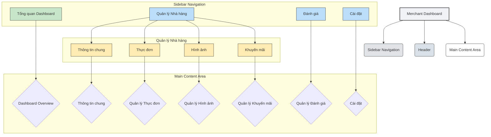

## Phương án Thiết kế Giao diện Quản lý Thương nhân (Merchant Dashboard)

Dựa trên cấu trúc và phong cách thiết kế hiện có của ứng dụng FoodieGram, tôi đề xuất phương án thiết kế giao diện quản lý dành cho nhóm người dùng thương nhân. Mục tiêu là tạo ra một môi trường hiệu quả, rõ ràng và dễ sử dụng để các nhà hàng/quán ăn có thể quản lý thông tin, thực đơn, khuyến mãi và tương tác với khách hàng.

### 1. Nguyên tắc Thiết kế Tổng thể

*   **Phong cách:** Chuyên nghiệp, gọn gàng, hiệu quả, mang hơi hướng cao cấp (kết hợp Soft Structuralism và Ethereal Glass), đồng bộ với ứng dụng FoodieGram.
*   **Bảng màu:** Sử dụng nhất quán bảng màu `oklch` hiện có, với màu cam/hổ phách là màu nhấn chính cho các hành động và thông tin quan trọng.
*   **Kiểu chữ:** Phông chữ `Geist` cho tiêu đề và nội dung chính; `Geist Mono` cho các dữ liệu hoặc thông tin kỹ thuật (nếu có).
*   **Bố cục:** Bố cục dạng dashboard, phản hồi tốt trên mọi thiết bị, ưu tiên thanh điều hướng cố định bên trái trên desktop và chuyển thành nav dưới/hamburger menu trên di động.
*   **Thành phần UI:** Tận dụng tối đa các thành phần Shadcn UI hiện có (Cards, Tables, Forms, Inputs, Buttons, Dialogs, etc.).
*   **Tương tác:** Phản hồi rõ ràng cho mọi hành động, chuyển đổi mượt mà nhưng tập trung vào hiệu quả hơn là hiệu ứng điện ảnh quá mức.

### 2. Các Chức năng Cốt lõi

1.  **Tổng quan Dashboard (Dashboard Overview):**
    *   Hiển thị tóm tắt các số liệu chính: Đánh giá trung bình, các món ăn phổ biến nhất (dựa trên số lượt "like").
    *   Các liên kết nhanh đến các tác vụ thường xuyên: Thêm món mới, tạo khuyến mãi, xem đánh giá mới.
    *   Khu vực thông báo/cảnh báo: Đánh giá mới, nhắc nhở khuyến mãi sắp hết hạn.

2.  **Quản lý Hồ sơ Nhà hàng (Restaurant Profile Management):**
    *   **Thông tin chung:** Chỉnh sửa tên, slogan, mô tả, danh mục ẩm thực, giờ hoạt động.
    *   **Thông tin liên hệ:** Quản lý địa chỉ, số điện thoại, email.
    *   **Hình ảnh:** Tải lên và quản lý ảnh đại diện, ảnh hero, ảnh thư viện của nhà hàng.
    *   **Vị trí:** Cập nhật tọa độ (latitude/longitude) cho tích hợp bản đồ chính xác.

3.  **Quản lý Thực đơn (Menu Management):**
    *   **Danh sách món ăn:** Thêm, chỉnh sửa, xóa các món ăn/thức uống.
    *   **Chi tiết món ăn:** Tên, mô tả, giá, hình ảnh, danh mục (ví dụ: món khai vị, món chính, đồ uống).
    *   **Sắp xếp:** Kéo và thả để sắp xếp lại thứ tự món ăn (tùy chọn nâng cao).
    *   **Danh mục thực đơn:** Quản lý các danh mục để phân loại món ăn.

4.  **Quản lý Khuyến mãi & Ưu đãi (Promotions & Offers Management):**
    *   Tạo, chỉnh sửa, xóa các chương trình khuyến mãi.
    *   Chi tiết khuyến mãi: Tiêu đề, mô tả, thời gian hiệu lực (ngày bắt đầu/kết thúc).
    *   Kích hoạt/Hủy kích hoạt khuyến mãi.

5.  **Quản lý Đánh giá & Xếp hạng (Review & Rating Management):**
    *   Xem tất cả các đánh giá và xếp hạng của khách hàng.
    *   Phản hồi đánh giá (tùy chọn).
    *   Lọc/sắp xếp đánh giá theo sao, ngày.

6.  **Quản lý người dùng nội bộ (Internal User Management - nếu có nhiều nhân viên quản lý một tài khoản):**
    *   Thêm/xóa nhân viên.
    *   Quản lý vai trò và quyền hạn.

7.  **Cài đặt (Settings):**
    *   Cài đặt tài khoản chung của thương nhân.
    *   Tùy chọn thông báo.

### 3. Cấu trúc Bố cục và Điều hướng

*   **Thanh điều hướng bên (Sidebar Navigation):** Luôn hiển thị ở bên trái trên desktop, chứa các mục điều hướng chính được liệt kê ở trên. Sử dụng các biểu tượng Lucide-react và các hiệu ứng hover nhất quán.
*   **Khu vực nội dung chính (Main Content Area):** Hiển thị các giao diện quản lý chi tiết. Sử dụng Shadcn `Card` và bố cục lưới để trình bày thông tin một cách có tổ chức.
*   **Thanh header:** Chứa tên nhà hàng đang quản lý, thông báo và có thể là một nút đăng xuất nhanh.

### 4. Lựa chọn Thành phần và Tương tác (Leveraging Shadcn UI)

*   **Dashboard:** `Card` cho các widget tổng quan, có thể dùng `Chart` cho các biểu đồ đơn giản.
*   **Form:** `Form`, `Input`, `Textarea`, `Select`, `RadioGroup`, `Checkbox` để quản lý thông tin nhà hàng, món ăn, khuyến mãi.
*   **Bảng:** `Table` để hiển thị danh sách món ăn, đánh giá. Hỗ trợ phân trang, sắp xếp và lọc.
*   **Thao tác dữ liệu:** `Button` cho các hành động thêm, chỉnh sửa, xóa. `AlertDialog` hoặc `Dialog` để xác nhận xóa hoặc hiển thị form chỉnh sửa chi tiết.
*   **Tải ảnh:** Sử dụng một input dạng file tùy chỉnh hoặc Shadcn `Input` với type `file` và xem trước hình ảnh.
*   **Chuyển đổi trạng thái:** `Switch` cho các tùy chọn kích hoạt/hủy kích hoạt.
*   **Thông báo:** `Toast` (`Sonner`) cho phản hồi hành động.

### 5. Minh họa Cấu trúc Dashboard (Mermaid Diagram)



---

## Redesign Audit & Kế hoạch Thực thi

> Phần này bổ sung sau khi đọc toàn bộ code hiện tại. Giữ nguyên phần thiết kế gốc ở trên, phần dưới là kết quả audit và plan chi tiết để implement.

### Audit: Vấn đề cần sửa

#### A. Shell (layout + sidebar + header) — Nghiêm trọng nhất

*   `layout.tsx` hardcode `bg-white dark:bg-zinc-900`, `border-zinc-800` — không dùng CSS variables của theme. Phải đổi sang `bg-sidebar`, `border-sidebar-border`.
*   `sidebar.tsx` không có active state — người dùng không biết đang ở trang nào.
*   `sidebar.tsx` dùng `<Home>` làm icon hamburger — sai icon, phải là `<Menu>`.
*   Sidebar không có branding/logo ở top, không có user info ở bottom.
*   `header.tsx` tên nhà hàng hardcode `"Delicious Bites"`, không có dark mode toggle, không có notification bell.

#### B. Dashboard Overview (`page.tsx`) — Trống, thiếu visual weight

*   3 card có visual weight bằng nhau — không có số liệu nổi bật.
*   Notifications card chỉ có text "No new notifications." — empty state không được thiết kế.
*   Quick Actions dùng `Button variant="outline"` với text link — không rõ ràng, thiếu icon.
*   Không có stat widget với số lớn nổi bật kiểu dashboard.

#### C. Tất cả pages — Không nhất quán

*   Mỗi page dùng `<h1 className="text-3xl font-bold">` — không có shared `PageHeader` component.
*   Không có page description dưới title.
*   Action button (Add/Create) nằm trong `CardHeader` — không nhất quán với layout.

#### D. Tables (menu, promotions, reviews) — Thiếu state và polish

*   Không có empty state khi danh sách rỗng.
*   Actions chỉ là text "Edit"/"Delete" — thiếu icon, thiếu visual affordance.
*   `menu/page.tsx`: không có search/filter bar, không có ảnh thumbnail trong table.
*   `promotions/page.tsx`: cột "Active" là raw Switch trong table — nên là Badge status, Switch chỉ trong dialog.
*   `reviews/page.tsx`: không có rating summary bar, không hiển thị response đã có dưới comment.
*   Category list trong menu dùng `border rounded-md div` — nên là Badge chips có nút xóa.

#### E. Forms — Thiếu UX cơ bản

*   `profile/page.tsx` tab Images: `<Input type="file">` thô, không có preview.
*   `settings/page.tsx` password fields: không có show/hide toggle.
*   Không có loading state trên nút Save/Submit.

---

### Design Language cần đồng bộ (từ `food-post.tsx` và `merchant/[id]/page.tsx`)

| Token | Giá trị áp dụng |
|---|---|
| Sidebar bg | `var(--sidebar)` / `bg-sidebar` |
| Sidebar border | `var(--sidebar-border)` / `border-sidebar-border` |
| Active nav item | `bg-accent text-accent-foreground font-semibold` |
| Card container | `rounded-2xl border border-border shadow-sm` |
| Primary CTA | `bg-primary text-primary-foreground` (oklch orange) |
| Stat icon bg | `bg-primary/10` (cam nhạt) |
| Metadata label | `text-[10px] uppercase tracking-wider text-muted-foreground/75 font-semibold` |
| Transition dashboard | `transition-colors duration-200` |
| Status: active | `bg-green-500/10 text-green-600` |
| Status: inactive | `bg-muted text-muted-foreground` |
| Status: expired | `bg-destructive/10 text-destructive` |

---

### Kế hoạch thực thi theo thứ tự

#### Phase 1 — Shell

**`app/merchant/layout.tsx`**
- Đổi `bg-white dark:bg-zinc-900` → `bg-sidebar`
- Đổi `border-zinc-800` → `border-sidebar-border`
- Đổi `bg-neutral-50 dark:bg-zinc-950` của main area → `bg-background`

**`components/sidebar.tsx`**
- Thêm logo section ở top: icon + "FoodieGram" text + badge "Merchant"
- Thêm `usePathname()` để detect active route
- Active: `bg-accent text-accent-foreground font-semibold rounded-lg`
- Hover: `hover:bg-sidebar-accent hover:text-sidebar-accent-foreground`
- Sửa hamburger icon: `<Home>` → `<Menu>`
- Thêm bottom section: avatar + tên nhà hàng + `<LogOut>` button

**`components/header.tsx`**
- Thêm `<Bell>` icon (notification)
- Thêm `<ThemeToggle>` component đã có sẵn
- Tên nhà hàng giữ mock nhưng đặt đúng vị trí

---

#### Phase 2 — Shared Components

**`components/merchant/page-header.tsx`** (file mới)
- title + optional description + optional action slot
- `title`: `text-2xl font-bold tracking-tight`
- `description`: `text-sm text-muted-foreground mt-1`
- layout: `flex justify-between items-start` + `border-b pb-6 mb-6`

**`components/merchant/stat-card.tsx`** (file mới)
- icon slot với `bg-primary/10 rounded-lg p-2`
- value: `text-3xl font-black tabular-nums`
- label: `text-xs uppercase tracking-wider text-muted-foreground`
- trend badge optional: `+2.4%` màu xanh/đỏ

---

#### Phase 3 — Dashboard Overview (`app/merchant/page.tsx`)

Layout mới:
```
Row 1: grid-cols-2 md:grid-cols-4
  [Rating Card] [Total Reviews] [Popular Dish Top] [Active Promos]

Row 2: grid-cols-1 md:grid-cols-3
  [Popular Dishes — col-span-2]  [Quick Actions — col-span-1]

Row 3:
  [Notifications — full width, list với badge màu]
```

Chi tiết:
- Stat cards dùng `StatCard` component, icon nền màu khác nhau
- Popular Dishes: list với `Progress` bar mini thay vì chỉ text
- Quick Actions: `grid grid-cols-1 gap-2`, mỗi action là button với icon lớn ở trái
- Notifications: list item với colored left-border và timestamp

---

#### Phase 4 — Menu Management (`app/merchant/menu/page.tsx`)

- Thêm toolbar: search input + filter by category (trên table)
- Table: thêm cột Image (thumbnail 40x40, `rounded-md object-cover`)
- Actions: đổi text `Edit`/`Delete` → `<Pencil>` / `<Trash2>` icon button
- Empty state: khi `dishes.length === 0`, hiện "Chưa có món ăn nào. Thêm món đầu tiên."
- Category chips: `<Badge variant="outline">` + `<X>` button xóa inline

---

#### Phase 5 — Promotions (`app/merchant/promotions/page.tsx`)

- Bỏ Switch trong table row, thay bằng `<Badge>` status:
  - `isActive && endDate >= today` → "Đang hoạt động" (xanh)
  - `!isActive` → "Tạm dừng" (xám)
  - `endDate < today` → "Đã hết hạn" (đỏ)
- Switch toggle: giữ trong dialog edit
- Actions: thêm icon `<Pencil>` và `<Trash2>`
- Empty state khi không có promotion

---

#### Phase 6 — Reviews (`app/merchant/reviews/page.tsx`)

- Thêm summary section ở đầu card:
  - Điểm TB lớn bên trái
  - Breakdown 5→1 sao với `Progress` bar bên phải
- Table: thêm `Avatar` nhỏ của khách trong cột Customer
- Hiện response đã có dưới comment: `bg-muted rounded-md p-2 text-sm italic` indent nhỏ
- Nút Respond: thêm `<MessageSquare>` icon

---

#### Phase 7 — Profile (`app/merchant/profile/page.tsx`)

- Tab Images: thay `<Input type="file">` bằng upload zone
  - `border-2 border-dashed border-border rounded-xl p-8 text-center cursor-pointer hover:border-primary`
  - `<UploadCloud>` icon + text hướng dẫn
  - Preview ảnh sau khi chọn (`URL.createObjectURL`)
- Tab Location: thêm link "Xem trên bản đồ" → `/map`
- Tất cả Save buttons: thêm `disabled` + `<Spinner>` khi submitting

---

#### Phase 8 — Settings (`app/merchant/settings/page.tsx`)

- Password fields: thêm `<Eye>`/`<EyeOff>` toggle show/hide
- Notification toggles: thêm `<p className="text-xs text-muted-foreground">` mô tả dưới mỗi label
- Thêm "Danger Zone" section cuối trang:
  - `border-destructive/20 bg-destructive/5 rounded-xl p-6`
  - Nút "Xóa tài khoản" → `AlertDialog` confirm

---

### Không làm

*   Không đụng `app/merchant/[id]/page.tsx` — đây là public merchant page, không phải dashboard
*   Không thay đổi logic/API calls, chỉ UI
*   Không cài thêm thư viện ngoài Shadcn UI đã có
*   Không thêm animation phức tạp — transition cơ bản là đủ cho dashboard
*   Không đổi font — Geist đã đúng theo plan gốc
